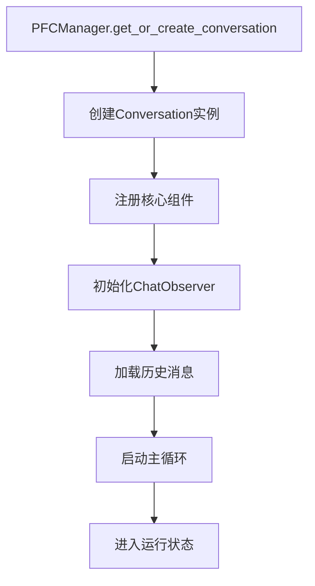
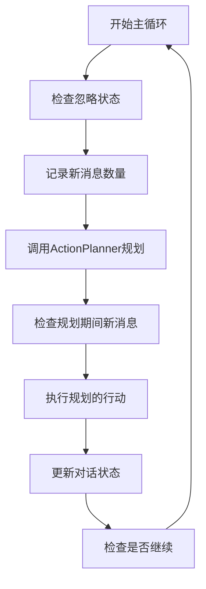
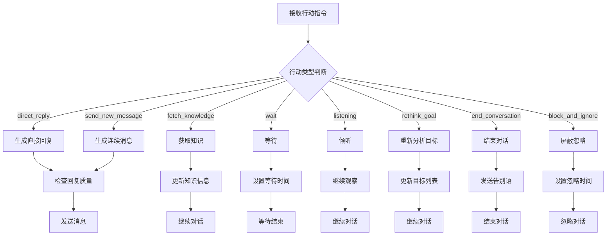
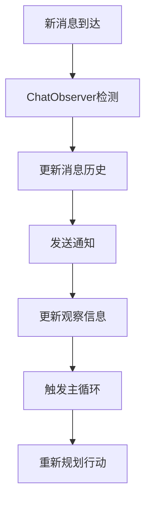
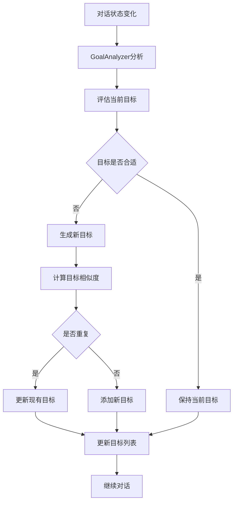

# PFC (Prefrontal Cortex) 模块文档

## 概述

PFC模块是MaiBot中的实验性对话管理系统，模拟人类前额叶皮层的功能，负责高级认知控制、决策制定和对话管理。该模块采用分层架构设计，通过多个专门组件协同工作，实现智能化的对话交互。

## 核心设计理念

### 1. 认知架构模拟
PFC模块基于认知科学理论，模拟人类前额叶皮层的功能：
- **目标管理**：设定和维护对话目标
- **决策制定**：基于当前状态选择最优行动
- **执行控制**：协调各个子系统的工作
- **状态监控**：实时观察对话状态变化

### 2. 分层组件设计
模块采用分层组件架构，每个组件负责特定功能：
- **观察层**：实时监控对话状态
- **分析层**：理解对话内容和目标
- **规划层**：制定行动策略
- **执行层**：生成和发送回复

## 核心组件

### 1. PFCManager (管理器)
**文件**: `pfc_manager.py`
**功能**: 对话实例的生命周期管理

```python
class PFCManager:
    """PFC对话管理器，负责管理所有对话实例"""
```

**主要职责**:
- 创建和管理对话实例
- 维护实例池，避免重复创建
- 处理实例的初始化和销毁
- 提供单例模式访问

**关键方法**:
- `get_or_create_conversation()`: 获取或创建对话实例
- `_initialize_conversation()`: 初始化对话实例
- `get_conversation()`: 获取已存在的实例

### 2. Conversation (对话核心)
**文件**: `conversation.py`
**功能**: 单个对话的完整生命周期管理

```python
class Conversation:
    """对话类，负责管理单个对话的状态和行为"""
```

**核心流程**:
1. **初始化阶段**: 注册所有组件，加载历史记录
2. **运行阶段**: 执行主循环 `_plan_and_action_loop()`
3. **状态管理**: 维护对话状态和组件状态

**主要组件**:
- `ActionPlanner`: 行动规划器
- `GoalAnalyzer`: 目标分析器
- `ReplyGenerator`: 回复生成器
- `ChatObserver`: 聊天观察器
- `KnowledgeFetcher`: 知识获取器
- `Waiter`: 等待管理器

### 3. ActionPlanner (行动规划器)
**文件**: `action_planner.py`
**功能**: 基于当前状态选择最优行动

**支持的行动类型**:
- `direct_reply`: 直接回复
- `send_new_message`: 发送新消息
- `fetch_knowledge`: 获取知识
- `wait`: 等待
- `listening`: 倾听
- `rethink_goal`: 重新思考目标
- `end_conversation`: 结束对话
- `block_and_ignore`: 屏蔽并忽略

**决策逻辑**:
- 分析当前对话目标
- 评估时间和超时情况
- 考虑历史行动结果
- 基于LLM进行智能决策

### 4. GoalAnalyzer (目标分析器)
**文件**: `pfc.py` (GoalAnalyzer类)
**功能**: 分析对话历史并设定目标

**目标管理特性**:
- 多目标支持：同时维护多个对话目标
- 目标相似度计算：避免重复目标
- 动态目标更新：根据对话进展调整目标
- 目标优先级管理：主要目标和备选目标

### 5. ChatObserver (聊天观察器)
**文件**: `chat_observer.py`
**功能**: 实时监控聊天状态变化

**观察功能**:
- 新消息检测
- 冷场状态监控
- 消息历史管理
- 时间戳跟踪
- 通知系统

**关键特性**:
- 异步消息获取
- 缓存机制
- 状态通知
- 冷场检测

### 6. ReplyGenerator (回复生成器)
**文件**: `reply_generator.py`
**功能**: 基于当前状态生成自然回复

**生成策略**:
- 根据行动类型选择不同提示词
- 考虑对话目标和知识信息
- 确保回复的自然性和连贯性
- 支持多种回复类型

**提示词类型**:
- `PROMPT_DIRECT_REPLY`: 首次回复
- `PROMPT_SEND_NEW_MESSAGE`: 连续回复
- `PROMPT_FAREWELL`: 告别语

### 7. ReplyChecker (回复检查器)
**文件**: `reply_checker.py`
**功能**: 检查生成回复的质量和适用性

**检查维度**:
- 内容相关性
- 重复性检测
- 长度控制
- 格式规范

### 8. KnowledgeFetcher (知识获取器)
**文件**: `pfc_KnowledgeFetcher.py`
**功能**: 从知识库获取相关信息

**知识获取流程**:
- 分析当前对话内容
- 提取关键查询词
- 从知识库检索相关信息
- 格式化知识信息

## 数据流程

### 1. 初始化流程


### 2. 主循环流程


### 3. 行动执行流程


### 4. 消息处理流程


### 5. 目标管理流程


## 状态管理

### 对话状态枚举
```python
class ConversationState(Enum):
    INIT = "初始化"
    RETHINKING = "重新思考"
    ANALYZING = "分析历史"
    PLANNING = "规划目标"
    GENERATING = "生成回复"
    CHECKING = "检查回复"
    SENDING = "发送消息"
    FETCHING = "获取知识"
    WAITING = "等待"
    LISTENING = "倾听"
    ENDED = "结束"
    JUDGING = "判断"
    IGNORED = "屏蔽"
```

### 状态转换规则
- **INIT → PLANNING**: 初始化完成后开始规划
- **PLANNING → GENERATING**: 规划完成后生成回复
- **GENERATING → CHECKING**: 生成完成后检查质量
- **CHECKING → SENDING**: 检查通过后发送消息
- **SENDING → WAITING**: 发送完成后等待响应
- **WAITING → PLANNING**: 等待结束后重新规划

## 配置和参数

### 关键配置项
- `global_config.llm_PFC_action_planner`: 行动规划器LLM配置
- `global_config.llm_PFC_chat`: 聊天生成器LLM配置
- `global_config.model.utils`: 工具类LLM配置

### 重要参数
- `cold_chat_threshold`: 冷场检测阈值（默认60秒）
- `max_goals`: 最大目标数量（默认3个）
- `update_interval`: 观察更新间隔（默认2秒）

## 错误处理和容错

### 异常处理策略
1. **组件初始化失败**: 记录错误并尝试重新初始化
2. **LLM调用失败**: 使用默认回复或重试机制
3. **消息发送失败**: 记录错误并继续对话
4. **知识获取失败**: 跳过知识获取继续对话

### 容错机制
- 异步操作超时处理
- 状态不一致检测和恢复
- 组件故障隔离
- 优雅降级策略

## 性能优化

### 缓存策略
- 消息历史缓存
- 知识查询结果缓存
- 目标分析结果缓存
- LLM响应缓存

### 异步处理
- 消息获取异步化
- 知识查询异步化
- 回复生成异步化
- 状态更新异步化

## 扩展性设计

### 插件化架构
- 行动类型可扩展
- 知识源可配置
- 回复生成器可替换
- 观察器可自定义

### 配置驱动
- 行为参数可配置
- 提示词模板可修改
- 阈值参数可调整
- 组件开关可控制

## 使用示例

### 基本使用
```python
# 获取PFC管理器
pfc_manager = PFCManager.get_instance()

# 创建或获取对话实例
conversation = await pfc_manager.get_or_create_conversation(
    stream_id="user_123", 
    private_name="测试用户"
)

# 对话会自动开始运行
```

### 自定义配置
```python
# 修改冷场检测阈值
conversation.chat_observer.cold_chat_threshold = 120.0

# 设置忽略时间
conversation.ignore_until_timestamp = time.time() + 3600

# 手动结束对话
conversation.should_continue = False
```

## 总结

PFC模块是一个功能完整、设计先进的对话管理系统，通过模拟人类认知过程，实现了智能化的对话交互。其分层架构、组件化设计和异步处理机制，为系统提供了良好的可扩展性和稳定性。该模块为MaiBot提供了强大的对话管理能力，是构建智能聊天机器人的重要基础。 